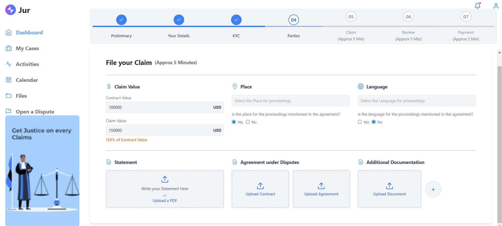
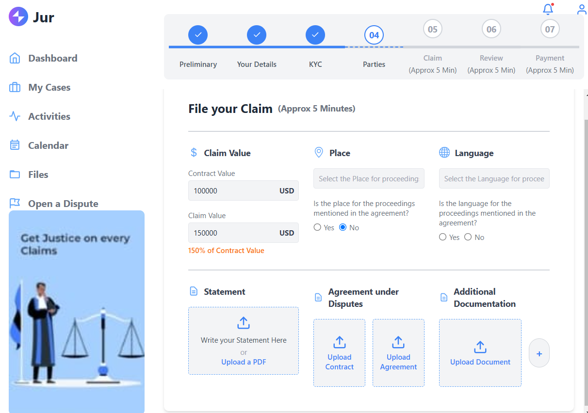
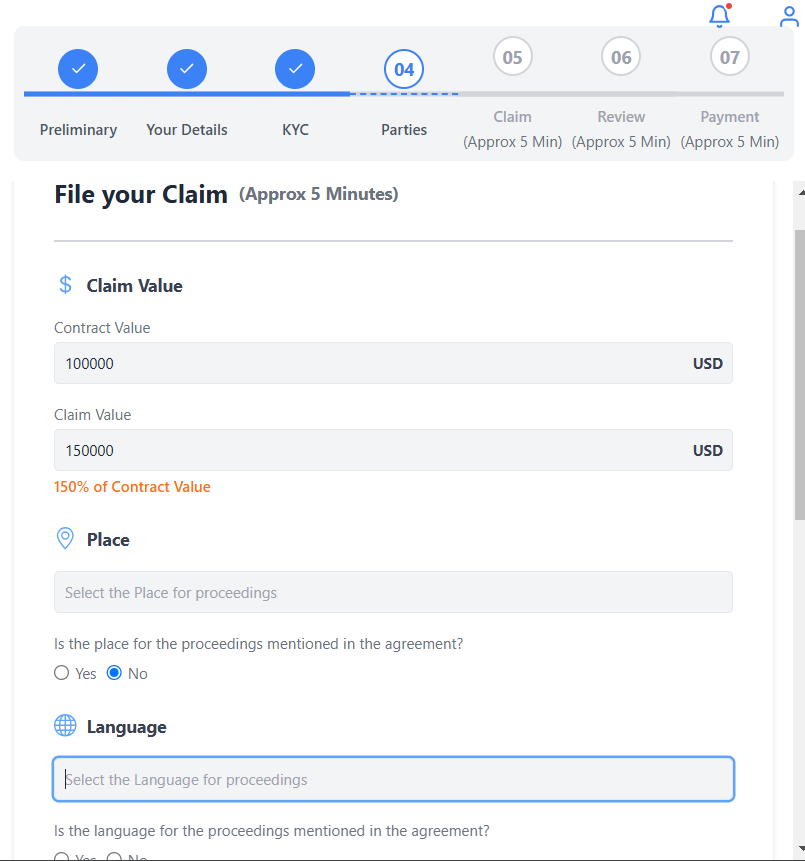

# Dashboard README

## Approach to Building the Dashboard

The dashboard was built with the following goals in mind:

### Responsiveness
- Designed to adapt seamlessly to different screen sizes (desktop, tablet, and mobile).
- Utilized **Tailwind CSS** for its utility-first approach, enabling rapid prototyping and fine-tuned responsive layouts.

### Modern Aesthetic
- Used **Tailwind’s gradient utilities**, padding, and rounded corners to create a clean and modern user interface.
- Incorporated icons from **react-icons** for visual clarity and interactivity.

### User Interaction
- Integrated clickable upload boxes with meaningful placeholder text and functionality.
- Ensured that every interactive element, such as radio buttons and file upload boxes, is intuitive and visually accessible.

### Alignment Consistency
- Maintained visual alignment between elements such as step circles and connector lines in the progress bar.
- Used standardized spacing and grid-based layouts for a cohesive structure.

---

## Challenges Faced and Their Solutions

### 1. Circles and Line Alignment
**Problem:**  
Initially, the circles in the progress bar were misaligned with the connecting lines, causing inconsistencies in the visual flow.

**Solution:**  
- Adjusted the positioning of the lines using relative positioning (`top-1/2`) to ensure vertical alignment.
- Fine-tuned the placement of dashed and solid lines with `translate-y` to ensure symmetry.
- Applied conditional Tailwind classes to differentiate between completed, current, and upcoming steps.

---

### 2. File Upload Interaction
**Problem:**  
The upload boxes initially did not visually reflect the interaction.

**Solution:**  
- Added placeholder content to guide users (e.g., _"Write your statement here or upload a PDF"_).
- Integrated `useRef` and `onClick` handlers for triggering file uploads, ensuring a smooth upload experience.
- Alerted users with the file name upon upload to confirm successful selection.

---

### 3. Alignment and Spacing
**Problem:**  
Spacing inconsistencies between elements (e.g., between upload boxes, circles, and lines).

**Solution:**  
- Used Tailwind’s `gap`, `space-y`, and `space-x` utilities for consistent horizontal and vertical spacing.
- Expanded the width of specific boxes for better visibility while maintaining alignment.

---

## Assumptions Made

### 1. Tailwind CSS Framework
- Assumed the project would use **Tailwind CSS** for styling to accelerate development and maintain consistency.
- Leveraged its prebuilt utilities such as `grid`, `flex`, `rounded`, and `gap` for layout and design.

### 2. Icons Library
- Used **react-icons** for icons to avoid the overhead of designing custom SVGs.

### 3. File Upload Functionality
- Assumed basic file upload functionality with no server-side integration.
- Implemented only client-side handlers to alert users upon file selection.

### 4. Desktop-First Design
- Designed primarily for desktop users but ensured a responsive layout for mobile and tablet devices using Tailwind’s responsive breakpoints (e.g., `md:grid-cols-3`).

---

## Preview
### Dashboard Features:
1. **Progress Bar**: Dynamically displays the status of steps with proper alignment and spacing.
2. **File Upload Sections**: Allows users to upload files interactively with visual feedback.
3. **Responsive Design**: Adjusts seamlessly across devices (desktop, tablet, and mobile).

---

## Technologies Used
- **React.js**: For building the dashboard components.
- **Tailwind CSS**: For rapid and consistent styling.
- **React Icons**: For modern and lightweight icon integration.

---

## How to Run the Dashboard
1. Clone the repository:
   ```bash
   git clone https://github.com/PrabhjotBajwa/Rise11_Dashboard.git
2. Navigate to the project directory:
   ```bash
   cd Rise11_Dashboard
3. Install dependencies:
   ```bash
   npm install
4. Start the Development server:
   ```bash
   npm start
5. Open your browser and go to http://localhost:3000.

## ScreenShots
### Desktop View


### Tablet View


### Mobile View


